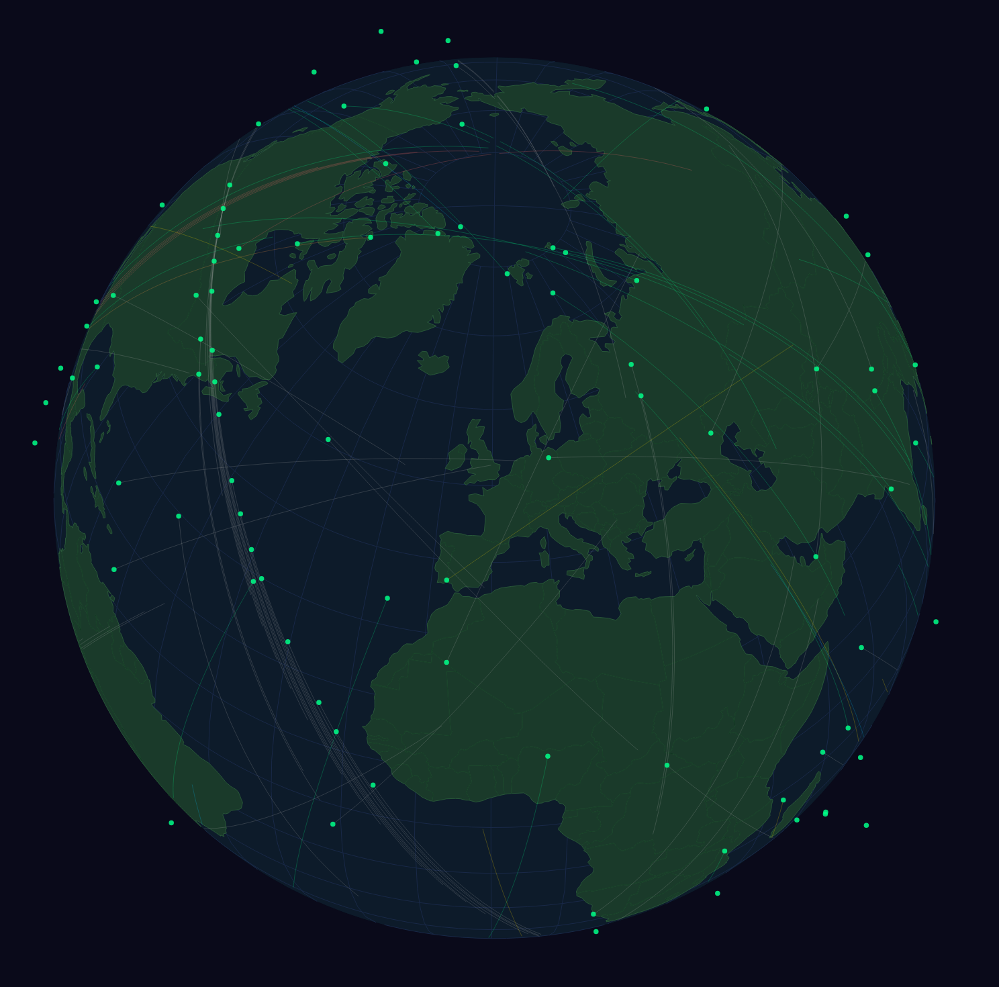

# tleglobe

A real-time satellite tracking globe. Live at [m0ofc.co.uk/tleglobe](https://m0ofc.co.uk/tleglobe/)

## Features

- Orthographic globe with SGP4 orbital propagation
- 200 LEO satellites + explicit ham radio and weather satellites
- Orbit trail prediction (1–90 min ahead)
- Satellite filtering by category (ham, weather, Starlink, COSMOS, FLOCK, other) with colour coding
- Click/tap to select satellites; hover tooltip (desktop) / name badge (mobile)
- Responsive — sidebar on desktop, bottom drawer on mobile
- Mobile: pinch-to-zoom, rotate/pan/zoom control buttons

## Stack

- [D3.js](https://d3js.org/) — orthographic projection and rendering
- [satellite.js](https://github.com/shashwatak/satellite-js) — SGP4 propagation
- [world-atlas](https://github.com/topojson/world-atlas) — country geometry via TopoJSON
- TLE data from [Space-Track.org](https://www.space-track.org/), refreshed every 6h via cron

## Usage

Open `website/index.html` in a browser. No build step required.

Point `website/globe.js` `fetch('data/visual.txt')` at a local TLE file, or use the live server's data endpoint.

### Controls

| Desktop | Mobile |
|---------|--------|
| Drag to rotate | Drag to rotate |
| Scroll to zoom | Pinch to zoom |
| Click satellite to select | Tap satellite for name badge |
| — | Rotate/pan/zoom buttons |
